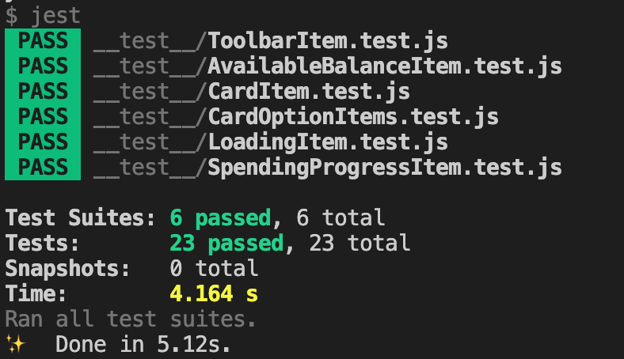
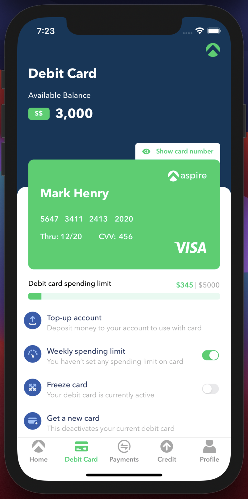
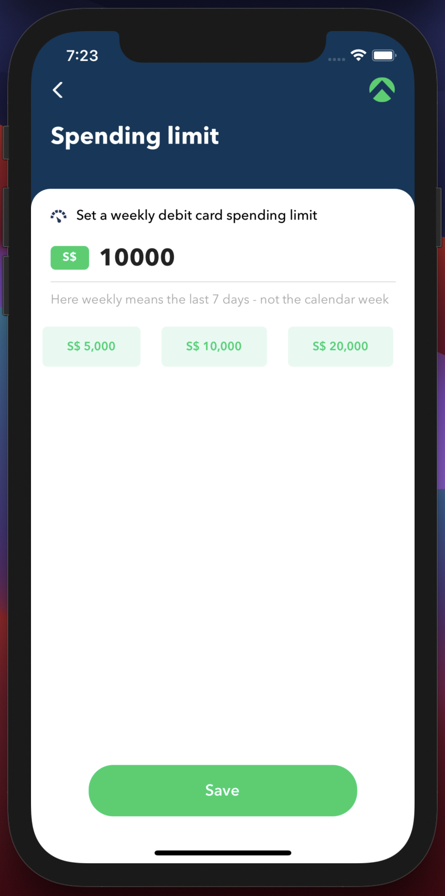

# Aspire-React-Native-Assignment
This repository contains source-code for mobile-app-coding-challenge provided by Aspire.

## Getting Started
- Clone the repository
- Install project-dependencies using:
    ```bash
    yarn install
    ```
- Once done, run the app on iOS simulator using:
    ```bash
    yarn ios
    ```
    on Android emulator using:
    ```bash
    yarn android
    ```
- Voila!

## Tech-Stack
- Expo
- React-Navigation
- Redux
- Redux-Saga
- Javascript (Typescript was optional)
- Jest & React-Native-Testing-Library (For Testing)

## Required Screens
Following is the list of screens required to complete the challenge:
- Debit Card Screen
- Weekly Spending Limit Screen

## Mock-API
The app uses following API for fetching data:
https://my-json-server.typicode.com/adwardstark/demo/card-details

## Component Breakdown
- **ToolbarItem**: Used across screens, supports navigation through back-arrow (togglable).

- **LoadingItem**: Used to show loading animation using progress-bar, while the app loads data from API.

- **AvailableBalanceItem**: Used to show available account balance of card.

- **CardItem**: Renders a card with owner details like card-number, expiry, cvv etc and supports option to show/hide details.

- **SpendingProgressItem**: Renders a progress-bar showing the amount spent weekly and the applied limit.

- **CardOptionItems**: Renders list of options that can be performed on the card.

## Project-Structure
- **components**: Contains all the rendered views.

- **navigation**: Contains routes and bottom-tabs for navigation.

- **redux**: Contains sources [ `actions, reducers, types and store` ] for state-management and `sagas` to make API calls using `redux-saga`.

- **resources**: Contains fonts, images and color styles.
- **screens**: Contains required screens.

## Testing
Test-cases are located in `__test__` directory, to run test-cases do:
```bash
yarn test
```
Once finished, you'll see a response like this:
</br>


## Screenshots
